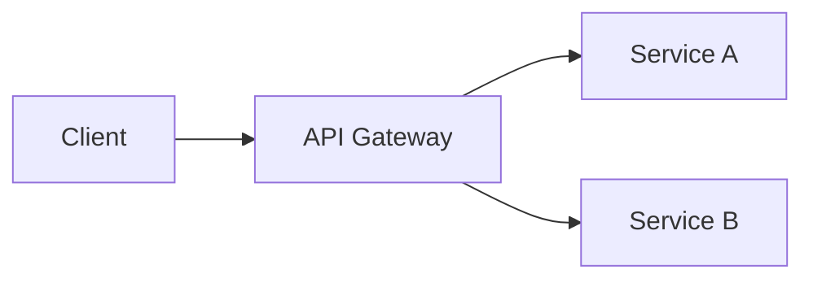

# GitHub Wiki 작성 가이드

GitHub Wiki를 효과적으로 활용하기 위한 표준 가이드입니다.

## Wiki vs docs/ 폴더

| 항목 | GitHub Wiki | docs/ 폴더 |
|------|-------------|-----------|
| 버전 관리 | 독립된 저장소 | 코드와 함께 |
| PR 리뷰 | 불가 | 가능 |
| 브랜치 | 단일 버전 | 브랜치별 버전 |
| 접근성 | 쉬움 (UI) | 개발자 친화적 |
| 검색 | Wiki 전용 | 코드 검색 |
| 편집 | 웹 UI 가능 | 파일 편집 |

### 권장 용도

**Wiki 사용:**
- 프로젝트 개요, 비전
- 사용자 가이드
- FAQ
- 온보딩 문서
- 안정화된 API 문서

**docs/ 폴더 사용:**
- 개발 중인 기능 문서
- ADR (설계 결정)
- API 변경 이력
- 환경 설정 가이드
- 트러블슈팅

## 표준 Wiki 구조

### 필수 페이지

```
Home                       # 프로젝트 홈 (랜딩 페이지)
1.-Project-Overview        # 프로젝트 개요
2.-Architecture            # 시스템 아키텍처
```

### 권장 페이지

```
3.-Domain-Model            # 도메인 모델 (복잡한 프로젝트)
4.-API-Specification       # API 명세
5.-Development-Guide       # 개발 가이드
6.-Deployment              # 배포 가이드
7.-Roadmap                 # 로드맵
8.-User-Guide              # 사용자 가이드
```

### 선택 페이지

```
9.-FAQ                     # 자주 묻는 질문
10.-Troubleshooting        # 문제 해결
11.-Contributing           # 기여 가이드
12.-Changelog              # 변경 이력
```

## 페이지별 작성 가이드

### Home (필수)

프로젝트의 첫인상을 결정하는 랜딩 페이지입니다.

**포함 내용:**
```markdown
# {프로젝트명}

> 한줄 설명

## 빠른 링크
- [프로젝트 개요](./1.-Project-Overview)
- [시작하기](./5.-Development-Guide)
- [API 문서](./4.-API-Specification)

## 기술 스택
| 영역 | 기술 |
|------|------|
| Backend | ... |
| Frontend | ... |
| Database | ... |

## 빠른 시작
\`\`\`bash
# 설치 및 실행 명령어
\`\`\`

## 주요 기능
- 기능 1
- 기능 2
```

### 1. Project Overview

**포함 내용:**
- 프로젝트 비전 및 목표
- 핵심 가치 제안
- 이해관계자
- 주요 기능 요약
- 프로젝트 범위 (In/Out of Scope)

### 2. Architecture

**포함 내용:**
- 시스템 아키텍처 다이어그램
- 서비스 구조
- 데이터 흐름
- 기술 스택 상세
- 디렉토리 구조

### 3. Domain Model (선택)

**포함 내용:**
- 유비쿼터스 언어
- ER 다이어그램
- 엔티티 명세
- 비즈니스 규칙
- 상태 다이어그램

### 4. API Specification

**포함 내용:**
- 인증 방식
- 공통 응답 형식
- 엔드포인트 목록 (그룹별)
- 에러 코드
- 예제 요청/응답

### 5. Development Guide

**포함 내용:**
- 개발 환경 요구사항
- 설치 및 실행 방법
- 환경 변수
- 코딩 컨벤션
- Git 전략
- 테스트 방법

### 6. Deployment

**포함 내용:**
- 배포 환경 구성
- Docker 설정
- CI/CD 파이프라인
- 환경별 설정
- 모니터링
- 트러블슈팅

### 7. Roadmap

**포함 내용:**
- 릴리스 히스토리
- 현재 버전 기능
- 향후 계획
- 기술 부채
- 변경 로그

### 8. User Guide

**포함 내용:**
- 사용자 유형별 가이드
- 화면별 사용법 (스크린샷)
- FAQ
- 문제 해결

## 페이지 네이밍 규칙

```
N.-Page-Title

예:
1.-Project-Overview
2.-Architecture
3.-Domain-Model
```

**규칙:**
- 숫자 prefix로 순서 지정
- 하이픈(-)으로 단어 구분
- 숫자와 제목 사이 점(.) 사용

## 다이어그램 작성

### ASCII Art (간단한 다이어그램)

```
┌─────────┐     ┌─────────┐
│ Client  │────▶│ Server  │
└─────────┘     └─────────┘
```

### Mermaid (GitHub 지원)



## Wiki 관리

### 로컬에서 편집

```bash
# 1. Wiki 저장소 클론
git clone https://github.com/{owner}/{repo}.wiki.git

# 2. 편집 후 커밋
cd {repo}.wiki
git add .
git commit -m "docs: update wiki"
git push
```

### docs/wiki/ 동기화

```bash
# 프로젝트의 docs/wiki/ → Wiki 저장소 동기화
cp docs/wiki/* ../{repo}.wiki/
cd ../{repo}.wiki
git add . && git commit -m "docs: sync from docs/wiki" && git push
```

## 체크리스트

### 새 프로젝트 Wiki 생성 시

- [ ] Home 페이지 생성
- [ ] Project Overview 작성
- [ ] Architecture 다이어그램 추가
- [ ] Development Guide 작성
- [ ] 사이드바 구성 확인

### 문서 업데이트 시

- [ ] 관련 페이지 모두 업데이트
- [ ] 링크 유효성 확인
- [ ] 날짜/버전 정보 갱신
- [ ] 스크린샷 최신화 (필요시)
